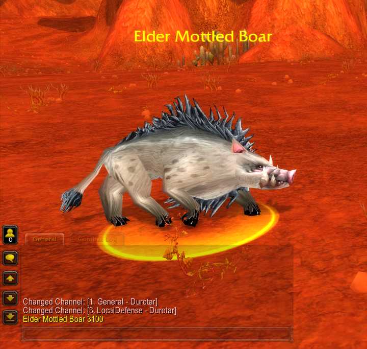
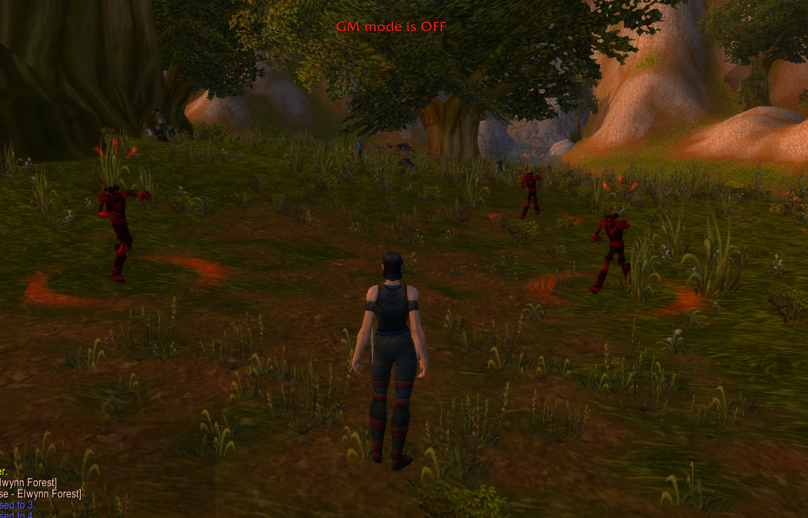

# Smart Scripts

[Back to Table of Contents](README.md)

We have learnt that there are two types of scripts in TSWoW, **data scripts**, that are used to create static game data and **live scripts**, that is used to program real-time responses to events. 

**Smart Scripting** is not a separate type of scripting, it's just an API that data scripts can use to define basic event reactions without having to use a dedicated live scripts, since those always require some extra setup and is always defined in a separate file.

This tutorial will briefly introduce smart scripting for creatures, but be aware that smart scripting is a broad topic that cannot be fully covered in a single tutorial. It is also, along with spells, among the things you will often have to experiment around with to get working properly. Therefore we will attempt to not only show you how to set up working smart scripts, but also show you how you can go about troubleshooting problems.

This tutorial will focus on smart scripts for **creatures**, but gameobjects and area triggers can also have smart scripts attached.

_**Note: Currently, only creature scripts are implemented in TSWoW.**_

## Smart Script Theory

All smart scripts are started by an **event** connected to a specific creature template. For example, an event might be "creature gains aggro", "creature dies" or "creature goes below x% hp". 

Events can have **Conditions** attached. Conditions can either concern the creature itself, or the entity that triggered the event (not every event has a "triggering unit"). A condition can be truth values such as "unit has above x% hp", "unit is a male", or "unit has item x". 

If an event fires and the correct conditions are met, the script can cause an **action**. An action might be "cast a spell", "call for help", "say something" or "begin walking along a waypoint".

A smart script has a single event, zero or more conditions and a single action. However, to make a single event cause multiple actions we can **chain together** multiple smart scripts, where one smart script is the event causing the next. TSWoW makes this chaining very simple, as we will see at the end of this tutorial.


_An example of smart script chaining, the "Gain aggro" event fires the first smart script, which itself fires the second._

Smart Scripts do not come from TSWoW, but is a special database table in TrinityCore that TSWoW wraps around, just like it wraps around tables for creatures, classes, items and so on. Sometimes, the TSWoW documentation might not be sufficient (or, less likely, even incorrect), and you may want to refer directly to the [official documentation for them instead](https://trinitycore.atlassian.net/wiki/spaces/tc/pages/2130108/smart+scripts). 

## Cast a spell

We will extend our zombie creature from the last tutorial so it will charge at the player when it enters combat, just like boars do. This begs the question, how do we figure out what spell (because, of course, charge is a spell) the boar uses to charge on combat?

Creatures do not "learn" spells like players do, as they can just cast any spell through smart scripts. We would therefore like to be able to inspect what smart scripts are attached to any given creature type, and TSWoW provides a function to this: `std.Scripts.printCreature`.

First, let's find a boar and grab its ID:



Now, we create a new file `EnemyScripts.ts` and add the following line of code:

```ts
std.scripts.printCreature(3100);
```

If we run the `check` command, we get the following output:

```
Range({"MinDist":0,"MaxDist":20,"RepeatMin":0,"RepeatMax":0})
    target:Self({})
    action:Cast({"SpellId":3385,"castFlags":0,"triggeredFlags":0})
```

The first un-indented row is an event, and this event appears to be called "Range". That's a bit cryptic, but if we look below it seems like the "action" part of this script is called "Cast", and has a spellId 3385 connected. We can probably guess that this means the boar casts a spell when it's within some range of something else. 

Now, we can attempt to copy this to our zombie. Add the following code to your `EnemyCreature.ts` file:

```ts
import { ZOMBIE } from './EnemyCreature'

// We create a script to respond to the "onRange" event.
// We choose our arguments to try and match what we saw in the print
const script = ZOMBIE.Scripts.onRange(0,20,0,0)
// The print had "self" as a target, so we try and match that.
script.Target.setSelf()
// We cast the same spell with the same arguments
script.Action.setCast(3385,0,0)
```

An indeed, if we rebuild and enter our zombie glade as a warrior, we can immediately see multiple zombies charging at us:



However, this raises a few questions. It looks like the event we just used does some kind of range check, but the arguments we gave it says that the **minimum** range to trigger the event is 0. Furthermore, the target of the spell is "self" and there doesn't seem to be anything mentioning that we have to be in aggro for it to work.

For situations like these, we might want to look at the [official TrinityCore documentation](https://trinitycore.atlassian.net/wiki/spaces/tc/pages/2130108/smart+scripts) about smart scripts, as it might mention something about this event specifically if TSWoW doesn't have any good comment documentation yet.

Indeed, if we try to `ctrl+f` the page for "range", we find a row in a table that looks like it describes our event:


It looks like the event has an implicit concept of a "target", and since creatures can only have targets in combat, that probably explains why this event can only fire when the creature enters combat. 

This still leaves one question unanswered: Why doesn't the event keep firing when the creature reaches its target, since the minimum distance is set to 0? The answer to this is not very obvious, and we encourage the reader to _attempt_ to figure out what's going on. 

## Conditions

Let's make it so our zombies only charge at warriors:

```ts
script.ConditionInvoker.addIsClass('WARRIOR')
```

Now, if we log in as a warrior the zombies should still charge, but not if we use any other class.

## Chaining

We will now demonstrate how to do chain multiple events together. Add the following to the bottom of your `EnemyCreature.ts`: 

```ts
// Create a new script chained to the original
const nextScript = script.then();
// Set the action to be saying a random line
nextScript.Action.setTalk([{enGB:'uuurgghhh'},{enGB:'Braaaaiiinnsss'}],10,0)
```

If we rebuild and log in, again as a warrior, we should see that the zombies will charge towards us and mumble about brains. If we log in as any other class, we should see that the zombies neither charge nor mumble about brains, since the first condition failed already. 

This means a condition cannot really be used to model "if-else" clauses, since it can only stop or not stop at any one point. Luckily, if we want our mob to say something different on the same event for a different class we can simply register a new event:

```ts
const rogueScript = ZOMBIE.scripts.onRange(0,20,0,0)
rogueScript.Action.setTalk({enGB:'Dumb rogue'},10,0)
rogueScript.ConditionInvoker.addIsClass('ROGUE')
```

Now, if we log in as a warrior the zombies should charge and mumble about brains, and if we log in as a rogue they should simply say "dumb rogue".

## Summary

In this tutorial, we have learnt:

- What a smart script is and how we can use it in data scripts
- The different parts of a smart script
- How to find information about smart scripts attached to an existing creature
- How to create a basic smart script
- How to attach conditions to a smart script
- How to chain multiple smart scripts together

[In the next tutorial](11_Quests.md), we will learn about Quests, and how we can use smart scripting for scripted quests.
