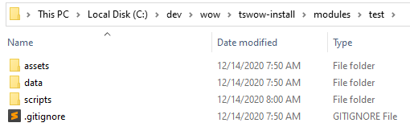
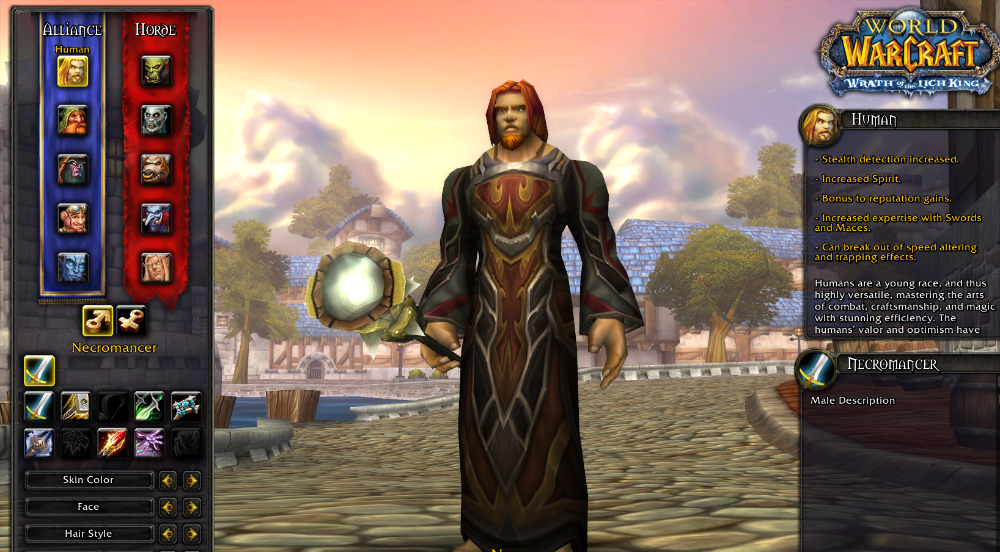
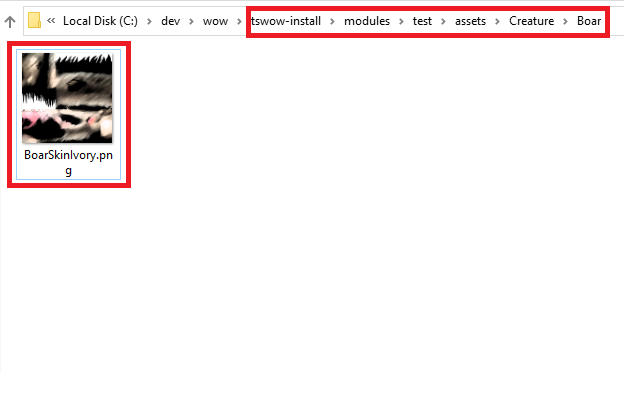

In this section, we will briefly explain how modding with TSWoW looks and feels like. There are no exercises here, just read it through and try to understand the basic concepts. When finished, you're not expected to understand **how** to create these types of mods, but simply know that they exist.

With TSWoW, we use the TypeScript programming language in the VSCodium/VSCode editor to modify the games data and behavior. Below is how modding typically looks, we have a code window and a terminal open to compile our code, and to restart and communicate with the server and client.


_A typical TSWoW development environment_

## Module Structure
TSWoW mods are divided into _modules_. A module is a folder containing scripts and game assets that modifies the game in some way. All modules are placed in the `modules` subdirectory in your TSWoW installation.

  
_Two modules installed_

  
_Contents of a typical TSWoW module_


_Module as viewed from VSCodium_


## The Three Types of TSWoW Mods

There are three types of mods that we can create with TSWoW: **Data Scripts**, **Live Scripts** and **Assets**. As you can see above, in each module we have a dedicated folder for each type. The **data** folder is for data scripts, the **scripts** folder is for live scripts and the **assets** folder is for assets. We will now briefly explain what each type of mod is used for.


### Data Scripts (data)

Data scripts are TypeScript code files that modify the World of Warcraft game data in some way by creating or modifying existing game entities, such as classes, items, quests, titles, and languages. These files are run only during development to create data files for the server and client, and never when the game is actually running. Below is an example of how a data script might look. 

```ts
// Create a class with id "tswow:necromancer", class id "NECROMANCER" and based on the Mage class.
export const NECROMANCER = std.Classes.create('tswow','necromancer','NECROMANCER','MAGE')
    .addRaces(['HUMAN','ORC','DWARF','UNDEAD','BLOODELF']) // Enable this class for those races
    .Name.set({enGB:"Necromancer"})
    .Stats.SpellCrit.set((x)=>x*2)
    .Stats.MeleeAttackPower.set("1337*level") 
    .EquipSkills.Staves.setAuto() // Enable staves at level 1
    .EquipSkills.Cloth.setAuto() // Enable cloth at level 1
```



_Code example of a fully working custom class made with a Data Script_

### Live Scripts (scripts)

Sometimes, we need extra custom behavior that data scripts cannot achieve, since all they do is modify or create static game data. For this, we use Live scripts, which allows us to run live code in the server when certain events happen, such as a creature taking damage, a player logging in or a guild being created. We write live scripts in TypeScript, and TSWoW transforms it into C++ that can be reloaded into the server without restarting it. For modding veterans, this is the TSWoW version of C++ scripts or Eluna lua scripts.  With live scripts, we get the best of both worlds since scripts are both easy to write thanks to autocompletion and highly performant thanks to the C++ transpiler. 

However, because Live Scripts are transformed into C++ they only support a **subset** of TypeScript, and are intended to register event listeners in a specific way. You can not use npm packages, and there are generally a lot of restrictions on how you can write this code.

```ts
// The main entry point a module
export function Main(events: TSEventHandlers) {
    // Register an event when a player says something
    events.Player.OnSay((player,msgType,lang,msg)=>{
        // Send a message to the player from the server
        player.SendBroadcastMessage('Hello world!');
    });
}
```


_Code example of a Live Script_

### Assets

Assets are simply resource files such as 3D models, textures and audio. These files will be automatically bundled to the client directory when you run your data scripts, and can both replace existing game assets and add new ones. Below is an example of using an asset replacement to change the texture of ivory boars.

_Note to veterans: To modify DBC, LUA or XML files you use data scripts, not assets._


  
_Silly boar recoloring using an asset replacement_

## Summary

You have now learnt the three things you can do with TSWoW:
- Use Data Scripts to modify **game data**
- Use Assets to replace **resource files and game assets**
- Use Live scripts to **script the server**

You should now be ready to get started and [install TSWoW](2_Installation.md)
