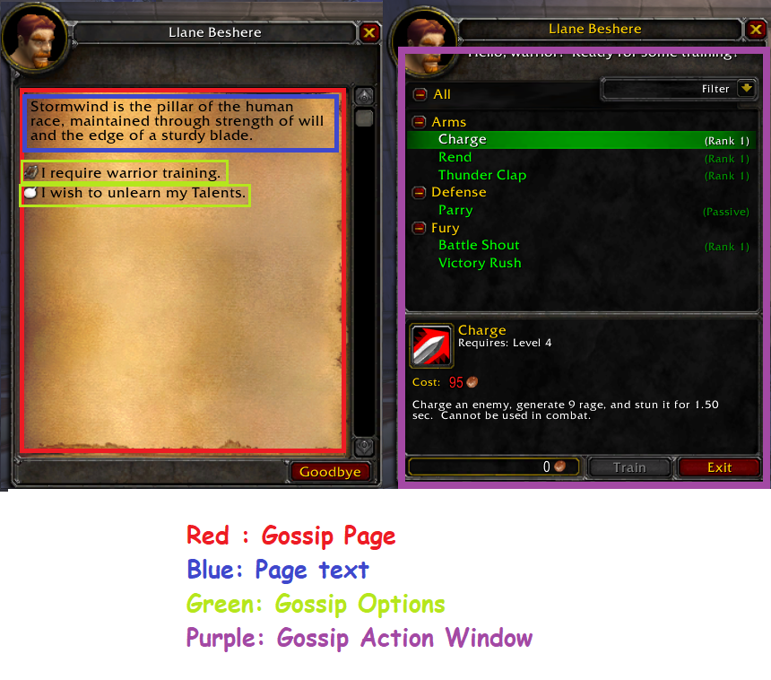
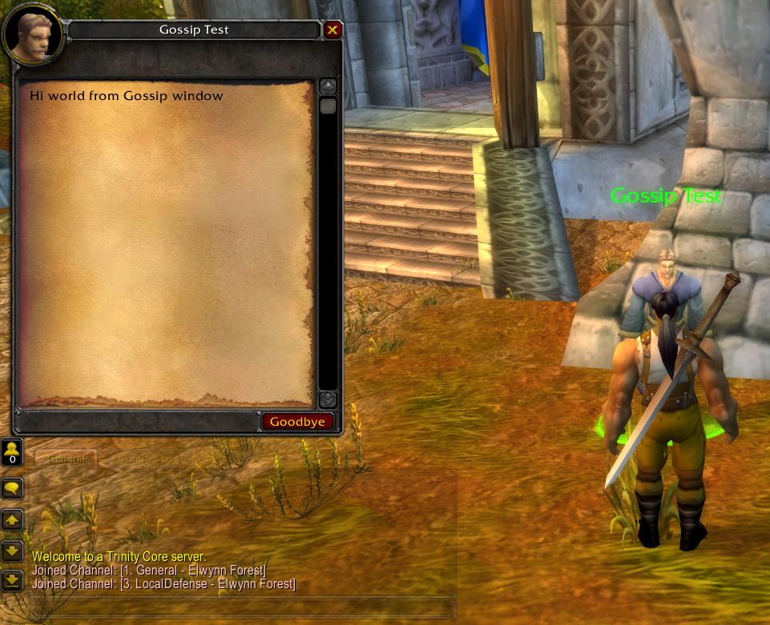
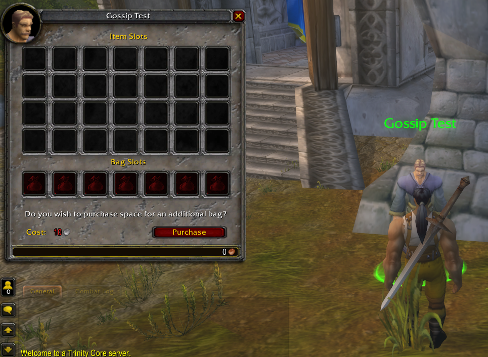
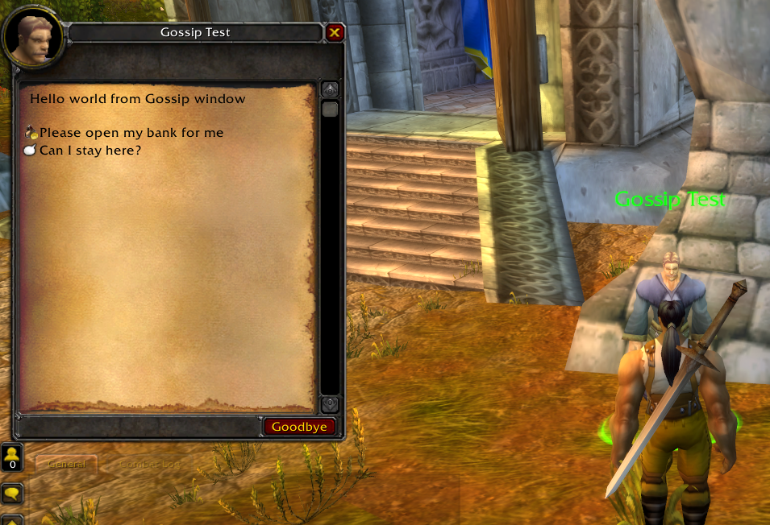
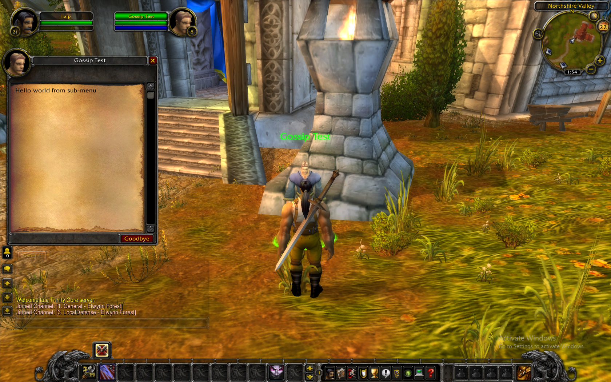
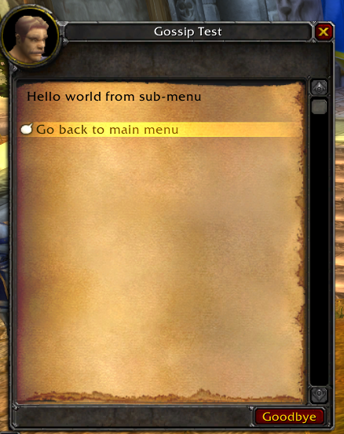
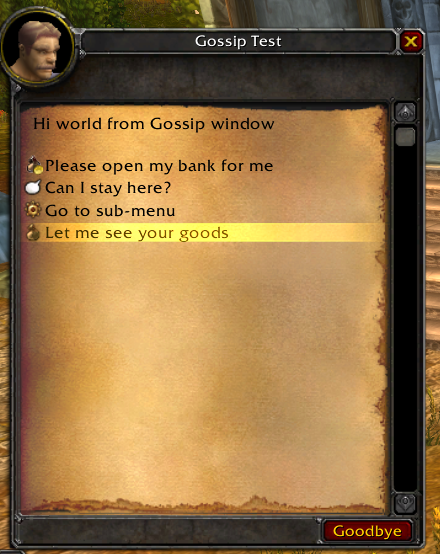
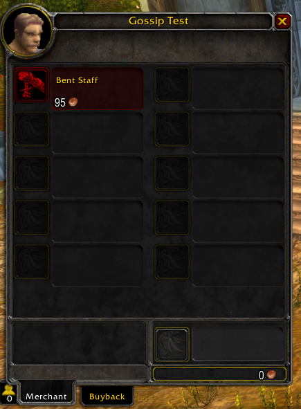
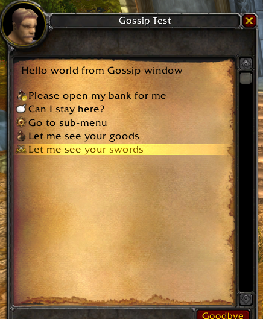

# Gossip

[Back to Table of Contents](README.md)

This tutorial will be an introduction to Gossip systems. Gossip in World of Warcraft. A gossip is the chat window you see with NPCs in the world. As we have seen previously, some gossip windows are automatically generated for us when we create NPCs such as trainers, but by explicitly creating gossip windows we can fully customize how these menus act and behave.

This gossip tutorial will focus on **static** gossips, that we build with data scripts. It is however possible to create fully **dynamic** gossip systems using live scripts, that will be covered in a future tutorial. 

_Temporary note: **dynamic** gossip systems are not yet implemented in TSWoW, but this tutorial only deals with **static** systems so everything here should work._

## Gossip Theory

A gossip menu has a few different parts, and we will briefly explain those here.

**Gossip Page**: A gossip page is a single displayed text window. 

**Gossip Option**: A gossip option is an option that the player can click. 

**Option Action**: An option action is what a gossip option does to the menu, such as opening a completely new gossip page, open a trainer window, vendor window, bank and so on. Some actions have separate menus associated with them, while others do not.



## Creating your first Gossip

In TSWoW, we tie gossip to specific creature templates. This means the first step in creating a gossip is to create a new creature template. Create a new file `Gossip.ts` in your module and add the following code:

```ts
import { std } from "tswow-stdlib";
import { Pos } from "tswow-stdlib/Misc/Position";

const MY_CREATURE = std.CreatureTemplates
    .create('mymod','mycreature',6373)

MY_CREATURE.Name.set({enGB:'Gossip Test'});

// Spawns this creature just outside of the Northshire Abbey entrance
MY_CREATURE.spawn('mymod','mycreature_spawn',
    Pos(0,-8923.843750,-136.506027,80.972542,1.902233))
```

You can rebuild your scripts and verify that this new creature is standing outside of Northshire Abbey, and you shouldn't be able to interact with it in any way.

Now, add the following to the bottom of `Gossip.ts`:

```ts
// Store the main gossip for this creature
const MAIN_GOSSIP = MY_CREATURE.Gossip;

// Set the gossip main display text
MAIN_GOSSIP.Text.add({enGB:'Hello world from Gossip window'});

// Alternate text (randomly selected)
MAIN_GOSSIP.Text.add({enGB:'Hi world from Gossip window'});
```

This is all we need to create a basic gossip window. Rebuild and check your creature again, this time you should be able to interact and you should see any the above texts in your gossip window. If you click the NPC enough times you should see both messages appear randomly.



### Gossip Options

Let's create a few basic gossip options we can click on. Add the following code:

```ts
// Creates a new option to open a bank
const BANK_OPTION = MAIN_GOSSIP.Options.add()
BANK_OPTION.Action.setBanker();
BANK_OPTION.Icon.set('MONEY_BAG')
BANK_OPTION.Text.set({enGB:'Please open my bank for me'});
```



When you rebuild and talk to the NPC, you will notice that the bank opens automatically. This is because, in WotLK, gossips will automatically open many common options automatically if it's the only option available. 

Let's add another option so we can again see our gossip window:

```ts
// Creates a new option to an innkeeper.
const INNKEEPER_OPTION = MAIN_GOSSIP.Options.add()
INNKEEPER_OPTION.Action.setInnkeeper();
INNKEEPER_OPTION.Icon.set('CHAT')
INNKEEPER_OPTION.Text.set({enGB:'Can I stay here?'});
```

You should now see that you get both the gossip options you created when you click on the NPC. You should also be able to verify that both options work as intended, and you can both access your bank and set this location as an inn.



## Creating Sub-menus

We have now shown how to add basic gossip options, so let's try and make sub-menus. The first step is to create a new option just like before, and then to set the action to open a "new gossip window". Add the following code:

```ts
// First, we create the sub-menu option
const SUBMENU_OPTION = MAIN_GOSSIP.Options.add()
SUBMENU_OPTION.Icon.set('COGWHEEL');
SUBMENU_OPTION.Text.set({enGB: ''})

// Now, we create the submenu itself from the option action
const SUBMENU = SUBMENU_OPTION.Action.setNewGossip();
SUBMENU.Text.add({enGB:'Hello world from sub-menu'});
SUBMENU_OPTION.Text.set({enGB: 'Go to sub-menu'})
```




Now, when you click the third option in your main gossip window, you should see that it leads you to the sub-menu. Now, let's add a link back to the main window:

```ts
const BACK_LINK = SUBMENU.Options.add()
BACK_LINK.Text.set({enGB:'Go back to main menu'});
BACK_LINK.Action.setGossipLinkID(MAIN_GOSSIP.ID)
```

You should now see that your sub-menu links back to the main menu, and you can toggle between them indefinitely.



## Creating Vendors

One of the more involved actions is a Vendor window, so let's see how to create those with TSWoW. In World of Warcraft, Vendor data is stored per creature template, but we will see how we can use TSWoW to circumvent this and access multiple vendors from a single creature.

_Multivendor functionality was made possible using [Rochet2's Multivendor module](https://rochet2.github.io/Multivendor.html)_

Add the following code:

```ts
// Creates a vendor stored on our own Creature ID. 
// The first vendor we create for a creature MUST
// use "ownVendor".
const VENDOR = VENDOR_OPTION.Action.setOwnVendor();

// Adds item id 35 to the shop (Bent staff)
VENDOR.addItem(35);
```

You should now be able to open your vendor and purchase a Bent staff for 95 copper. 





Price informations is stored in items themselves, and we will learn more about creating items in a future tutorial. However, if you want to, you can add the following code to manipulate the price of that particular item:

```ts
// Change the price so players can sell the item for 50 copper and buy it for 1 silver.
std.Items.load(35).Price.set(50,100);
```

To create multiple vendors in a single creature, we will use the second vendor function. Note that the rule to "set the own vendor before multi-vendor" applies once for a single creature, not for individual sub-menus. You can now add any multivendors you'd like to any submenus. The following code adds an additional vendor to your existing menu:

```ts
const VENDOR_2_OPTION = MAIN_GOSSIP.Options.add()
VENDOR_2_OPTION.Icon.set('CROSSED_SWORDS')
VENDOR_2_OPTION.Text.set({enGB:'Let me see your swords'})

const VENDOR_2 = VENDOR_2_OPTION.Action.setMultivendor()

// Adds item ID 25 (Bent Sword)
VENDOR_2.addItem(25)
```



## Same Gossip for Multiple Creatures

One notable difference between TSWoW and many other gossip systems is that TSWoW always couples a gossip system to a specific creature. We have chosen to do this to make them easier to create without errors, but with the drawback that a gossip menu only applies to a single creature. This also makes it slightly difficult to edit existing gossip menus in WoW, and you are encouraged to write your own when possible.

The TSWoW way to apply a single Gossip window to multiple creatures is to simply use a for-loop to add identical gossip menus to all the creatures that should share them, as this is the safest way that should cause the least amount of unexpected errors. The following code demonstrates how to achieve this easily:

```ts
// Create the first creature
const CREATURE_A = std.CreatureTemplates
    .create('mymod','creature_a',6373)
CREATURE_A.Name.set({enGB:'Creature A'})

// Create the second creature
const CREATURE_B = std.CreatureTemplates
    .create('mymod','creature_b',6373)
CREATURE_B.Name.set({enGB:'Creature B'})

// Create a list and iterate over both creatures
const creatures = [CREATURE_A,CREATURE_B];
for(const creature of creatures) {
    // Load the gossip context for the current creature
    const gossip = creature.Gossip;
    gossip.Text.add({enGB:'My Gossip Menu'})

    // Add an option just like you normally would.
    const option = gossip.Options.add();
    option.Text.set({enGB:'Go to Sub-menu'})
    const newGossip = option.Action.setNewGossip();
    newGossip.Text.add({enGB:'Sub-menu'});
}
```

Generally, cloning data is the preferred way to do most TSWoW modding as it drastically reduces unexpected behavior and takes up very little extra storage space for most applications. Procedural programming is a very powerful tool exactly for this behavior.

## Summary

This concludes our introduction to Gossips in TSWoW. You have learnt:

- How to create a simple one-page Gossip menu
- How to add gossip options for banks, innkeepers and vendors.
- How to create sub-menus and links to other gossip menus.
- How to apply identical gossip menus to multiple creatures using for-loops.

Our final `Gossip.ts` becomes: 

```ts
import { std } from "tswow-stdlib";
import { Pos } from "tswow-stdlib/Misc/Position";

const MY_CREATURE = std.CreatureTemplates
    .create('mymod','mycreature',6373)

MY_CREATURE.Name.set({enGB:'Gossip Test'});

// Spawns this creature just outside of the Northshire Abbey entrance
MY_CREATURE.spawn('mymod','mycreature_spawn',
    Pos(0,-8923.843750,-136.506027,80.972542,1.902233))

// Store the main gossip for this creature
const MAIN_GOSSIP = MY_CREATURE.Gossip;

// Set the gossip main display text
MAIN_GOSSIP.Text.add({enGB:'Hello world from Gossip window'});

// Alternate text (randomly selected)
MAIN_GOSSIP.Text.add({enGB:'Hi world from Gossip window'});

// Creates a new option to open a bank
const BANK_OPTION = MAIN_GOSSIP.Options.add()
BANK_OPTION.Action.setBanker();
BANK_OPTION.Icon.set('MONEY_BAG')
BANK_OPTION.Text.set({enGB:'Please open my bank for me'});

// Creates a new option to an innkeeper.
const INNKEEPER_OPTION = MAIN_GOSSIP.Options.add()
INNKEEPER_OPTION.Action.setInnkeeper();
INNKEEPER_OPTION.Icon.set('CHAT')
INNKEEPER_OPTION.Text.set({enGB:'Can I stay here?'});

// First, we create the sub-menu option
const SUBMENU_OPTION = MAIN_GOSSIP.Options.add()
SUBMENU_OPTION.Icon.set('COGWHEEL');
SUBMENU_OPTION.Text.set({enGB: ''})

// Now, we create the submenu itself from the option action
const SUBMENU = SUBMENU_OPTION.Action.setNewGossip();
SUBMENU.Text.add({enGB:'Hello world from sub-menu'});
SUBMENU_OPTION.Text.set({enGB: 'Go to sub-menu'})

const BACK_LINK = SUBMENU.Options.add()
BACK_LINK.Text.set({enGB:'Go back to main menu'});
BACK_LINK.Action.setGossipLinkID(MAIN_GOSSIP.ID)

// Creates a vendor stored on our own Creature ID. 
// The first vendor we create for a creature MUST
// use "ownVendor".
const VENDOR = VENDOR_OPTION.Action.setOwnVendor();

// Adds item id 35 to the shop (Bent staff)
VENDOR.addItem(35);

// Change the price so players can sell the item for 50 copper and buy it for 1 silver.
std.Items.load(35).Price.set(50,100);

const VENDOR_2_OPTION = MAIN_GOSSIP.Options.add()
VENDOR_2_OPTION.Icon.set('CROSSED_SWORDS')
VENDOR_2_OPTION.Text.set({enGB:'Let me see your swords'})

const VENDOR_2 = VENDOR_2_OPTION.Action.setMultivendor()

// Adds item ID 25 (Bent Sword)
VENDOR_2.addItem(25)

// Create the first creature
const CREATURE_A = std.CreatureTemplates
    .create('mymod','creature_a',6373)
CREATURE_A.Name.set({enGB:'Creature A'})

// Create the second creature
const CREATURE_B = std.CreatureTemplates
    .create('mymod','creature_b',6373)
CREATURE_B.Name.set({enGB:'Creature B'})

// Create a list and iterate over both creatures
const creatures = [CREATURE_A,CREATURE_B];
for(const creature of creatures) {
    // Load the gossip context for the current creature
    const gossip = creature.Gossip;
    gossip.Text.add({enGB:'My Gossip Menu'})

    // Add an option just like you normally would.
    const option = gossip.Options.add();
    option.Text.set({enGB:'Go to Sub-menu'})
    const newGossip = option.Action.setNewGossip();
    newGossip.Text.add({enGB:'Sub-menu'});
}
```

Trainers windows work very similar to vendors, and you can also have multiple. Your challenge for this section is to add one or multiple class trainers to this gossip system.

In the next tutorial, we will start to look at [enemy creatures and creature ai]() (not written yet).