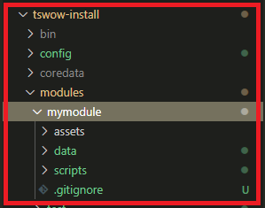

In this section, we will start using a basic TSWoW module and add a datascript that we will compile. The purpose of this tutorial is to give you a feeling for how modding with TSWoW is like, so don't worry too much if you do not entirely understand the scripts you are asked to write yet.

You should have read the [Modding Introduction](1_ModdingIntroduction.md) and [installed TSWoW](2_Installation.md) already.

## Creating a Module

Start up your VSCodium editor in the TSWoW directory and start TSWoW from the terminal (`npm run start`).

Once TSWoW has started, type the command `create module mymodule --datascripts --assets --livescripts`. This will create a new directory called _mymodule_ in your modules folder.

{:refdef: style="text-align: center;"}

{:refdef}

## Building Data Scripts

We can see that TSWoW has already created the basic mod directories for us. If we look at the `datascripts` folder, we can see that there is a a file `mymodule-data.ts` waiting for us. This is the main entry point for your data scripts, and you should not rename it. You can create any other amount of data scripts in this and any subdirectories too, and other script files do not need to be imported by this file to work.

To build the data script we have here, type the command `build data --readonly` into the TSWoW terminal. You should see output similar to the following:
```
check
Hello from mymodule data script!
```

Because we passed the `--readonly` command, no data was actually written for this build, and the server/client won't restart.

## Client build

Replace the contents of your `mymodule-data.ts` file with the following:

```ts
import { std } from 'tswow-stdlib';

// Load the warrior class
const WARRIOR_CLASS = std.Classes.load(1)

// Change english name to "Adventurer" (even enUS clients uses enGB)
WARRIOR_CLASS.Name.enGB.set('Adventurer');

// Change character creation description
WARRIOR_CLASS.UI.Description.set('Adventurers adventure the world!');
```

Now that our data script actually does something, we can try it out with the `build data --client-only` command. Since we are only changing a name, we only need to build client data to check it out. You should see output similar to the following:
```
build data client
Built SQL/DBC/MPQ data in 2.27s
```

You should also notice that TSWoW restarted the client for you in the background. If we enter the character creation screen, we can see that we have indeed changed the name of Warrior to Adventurer.

{:refdef: style="text-align: center;"}

{:refdef}

{:refdef: style="text-align: center;"}

{:refdef}

## Server build

Let's try to make a more meaningful change to the game by changing the strength of a warrior. Add the following to your script file:

```ts
// Change strength stat for all levels
std.Classes.load('WARRIOR').Stats.Strength.set(x=>99);
```

For this change, it will not be sufficient to just rebuild the client because strength is a serverside calculation. This is the case for any kind of change that is not just aesthetic. To rebuild both the client and server, you use the `build data` command. You should notice that both the client and server will restart. Log in as a warrior again and check your strength.

## Generated IDs and String Identifiers

Every kind of entity in World of Warcraft, from items to quests to classes, has a numerical **ID** that makes it unique among its type. For example, Hogger has the numerical creature type ID 448, and no other creature has this ID. If anything else in the game has a reference to a creature type and the reference is to 448, that's a reference to Hogger. It is possible for IDs of different types to overlap, for example creature type id 36 is to "Harvest Golem", while item id 36 is to "worn mace".

Numerical IDs are tricky, because we have to manually make sure that they don't collide with each others. In TSWoW, we generate a lot of numerical IDs automatically without any additional input needed, but sometimes we need IDs to be **persistent** each time we build our module, since the numerical IDs are used by the server to keep track of things like the items a player has equipped, or how many times they have slain a particular creature. It wouldn't be nice to have your heroic purple sword be changed to a gray item just because the generated id changed.

To solve this problem we use **string identifers** when we create entities to automatically generate a unique numerical ID that will stay persistent even if we build our module multiple times. To avoid collisions, we split string IDs into two parts, a "mod identifier" part, describing the module that created the entity, and an "entity identifier" part, that should uniquely identify the entity in our mod.

For example, if we have a module called "tswow-tutorial", and an item called "Baseball", it would have the mod identifier "tswow-tutorial" and the entity identifier "baseball". We should write all our string identifiers in lowercase only, and use hyphens (-) between words, just like with module names. If another mod also had an item called "Baseball", it would not collide with our identifier, since they would have the full identifier "theirmod:baseball", while our would have "ourmod:baseball".

### Creating an entity

To illustrate ID generation with string identifiers, we will create a simple sword based on Thunderfury (item id=19019). Create a file `Sword.ts` in your mods data directory and write the following code:

```ts
import { std } from 'tswow-stdlib'

const THUNDERFURY_2 = std.Items
    .create(
        // The module id, replace with the name of your module
        'my-module',
        // The entity id, must be unique in 'my-module'
        'thunderfury-2',
        // Numerical ID for the original Thunderfury
        19019
    )
THUNDERFURY_2.Name.enGB.set('Thunderfury 2');
```

Here, we supply the create functions with the arguments 'my-module','thunderfury-2', and 19019. If we follow the autocompletion, we can see that the parameter names are "mod", "id" and "parent", respectively. Whenever a function in TSWoW asks for a "mod" and an "id" parameter, you can be sure that it's asking you for your current module and a new **unique** entity id. The third argument in this example, parent, is the numerical ID of the item we want to copy.

### String Identifiers: Only used Once

In TSWoW, we use the mod/id string identifiers **only** when we create an entity for the first time, and after that never again. Instead we use the numerical ID that was generated. To see what ID was generated for our new item, add the following code to the bottom of your `Sword.ts` file:

```
console.log(THUNDERFURY_2.ID);
```

When you build this script, you should see that it prints out a pretty large number. If we ever want to reference this sword anywhere else in our data scripts, we reference `THUNDERFURY_2.ID`. If we want to use this ID in another code file, we can simply change our declaration line to `export const THUNDERFURY_2 = std.Items` and import it from this file.

To give yourself an item in-game, you can use the command `.additem id`, where id is the **numerical** ID of the item you want. Try to figure out how to give yourself Thunderfury 2.

## Conclusion

In this tutorial, you have created a basic module for TSWoW and made some changes to existing game data.
